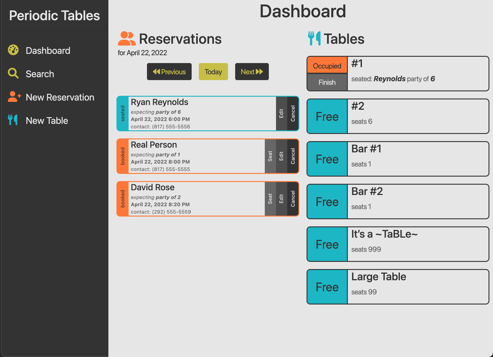
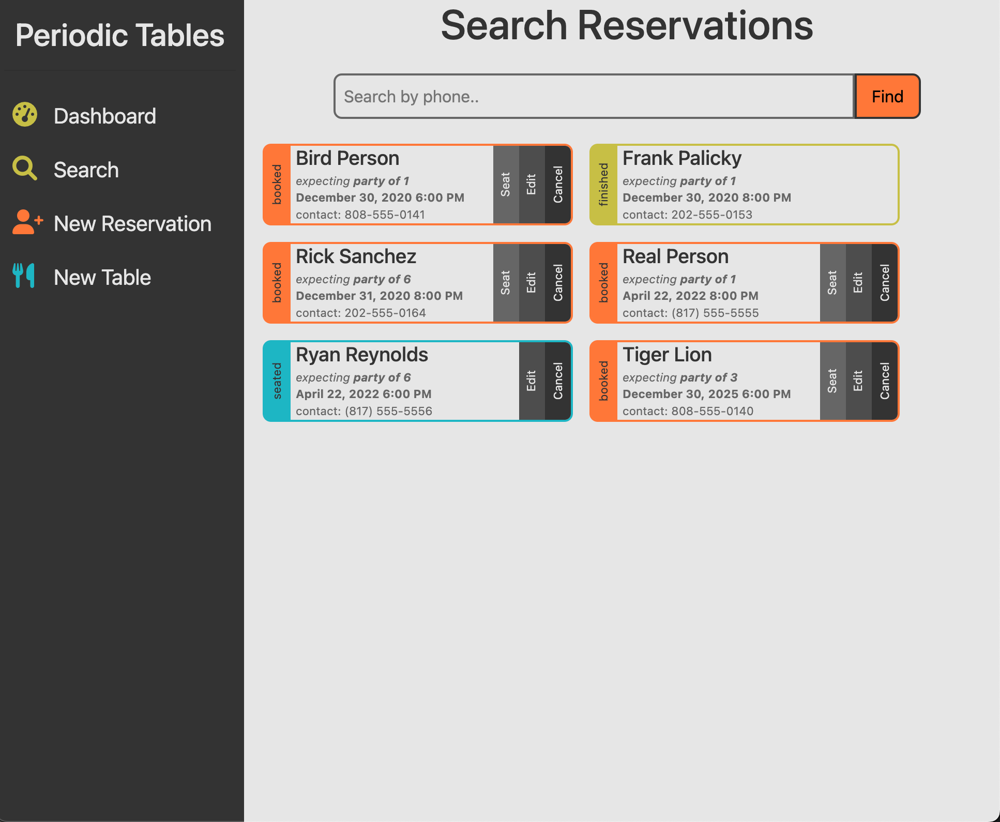
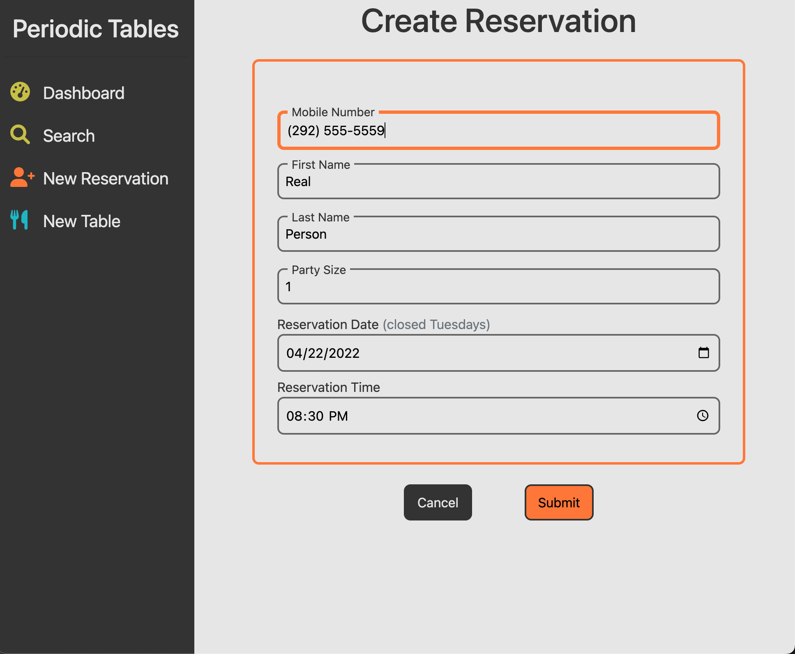
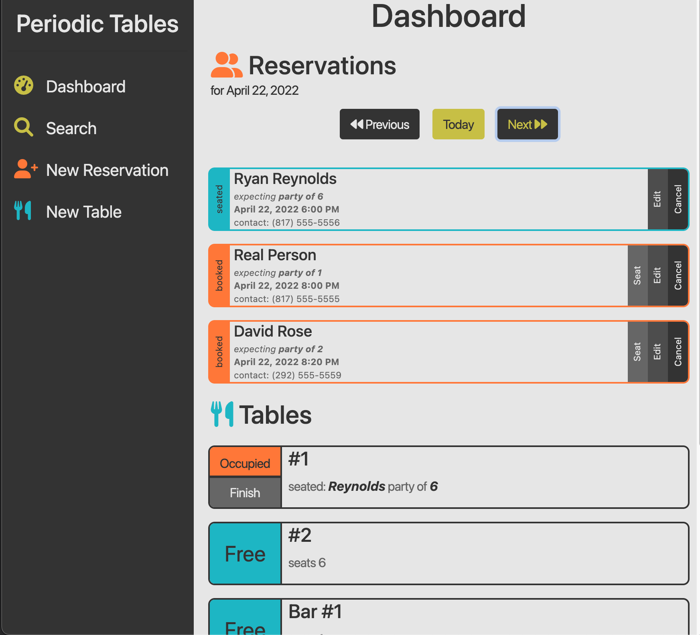
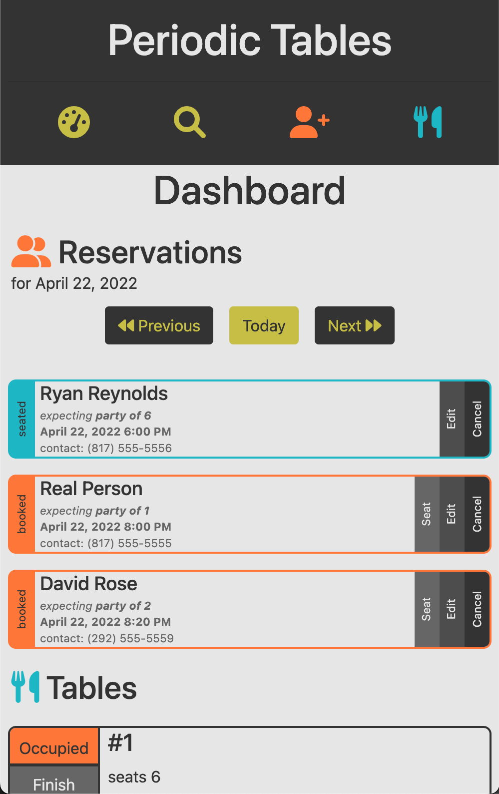

# Tabled Periodically
<br>

[_view live app here_](https://tp-fe.herokuapp.com)


<br>


An in-house restaurant table/reservation system
- Allows internal staff to:
  - reservations:
    - schedule new reservation
    - edit reservation
    - cancel reservation
    - seat reservation at a table
    - and search reservations by phone number
  - tables:
    - create new table
    - seat with reservation
    - and finish seated reservations
- Designed with a mobile first approach
- Works for any screen size
 
<br>
<br>
<br>
<hr>

 ## API Documentation
 <hr>

 API base url: [https://tp-be.herokuapp.com/](https://tp-be.herokuapp.com/`)

| **API Path** | **Method(s)**|
|-------:|:--------|
| `/reservations`	|`GET`: List all reservations|
| `/reservations`	|`POST`: Create a new reservation.|
| `/reservations/?date='YYYY-MM-DD'`	|`GET`: List all reservations by date.|
| `/reservations/?mobile_number='###'`	|`GET`: List all reservations by ```mobile_number``` with a partial match.|
| `/reservations/:reservation_id`	|`GET`: Read a single reservation by ```reservation_id```.|
| `/reservations/:reservation_id`	|`PUT`: Update a reservation by ```reservation_id```.|
| `/reservations/:reservation_id/status`	|`PUT`: Update a reservation's status. Options being "booked", "seated", "cancelled", or "finished".|
| `/tables`	|`GET`: List all tables.|
| `/tables`	|`POST`: Create a new table.|
| `/tables/:table_id/seat`	|`PUT`: Update a table's status to "occupied" via adding ```reservation_id```.|
| `/tables/:table_id/seat`	|`DELETE`: Update a table's status to "free" via removing ```reservation_id```.|

<br>
<br>
<br>
<hr>

## Tech Stack
<hr>

### _Frontend_

Bootstrap<br>
CSS<br>
HTML<br>
JavaScript<br>
React<br>

### _Backend_

JavaScript<br>
Node.js<br>
Express<br>
Knex<br>

### _Additional_

PostgreSQL<br>
ElephantSQL<br>
Production Site Through Heroku<br>
<br>
<br>
<br>
<hr>


## Screenshots

__/dashboard__

<br>

__/search__

<br>

__/reservations/new__

<br>

__mid size dashboard__

<br>

__mobile dashboard__

<br>


<br>
<br>
<br>
<hr>

## Installation instructions
<hr>

1. Fork / clone / download this repository.
2. Run `cp ./back-end/.env.sample ./back-end/.env`.
3. Update the `./back-end/.env` file with the connection URL's to your ElephantSQL database instance.
4. Run `cp ./front-end/.env.sample ./front-end/.env`.
5. Run `npm install` to install project dependencies.
6. Run `npm run start:dev` to start the application in development mode.